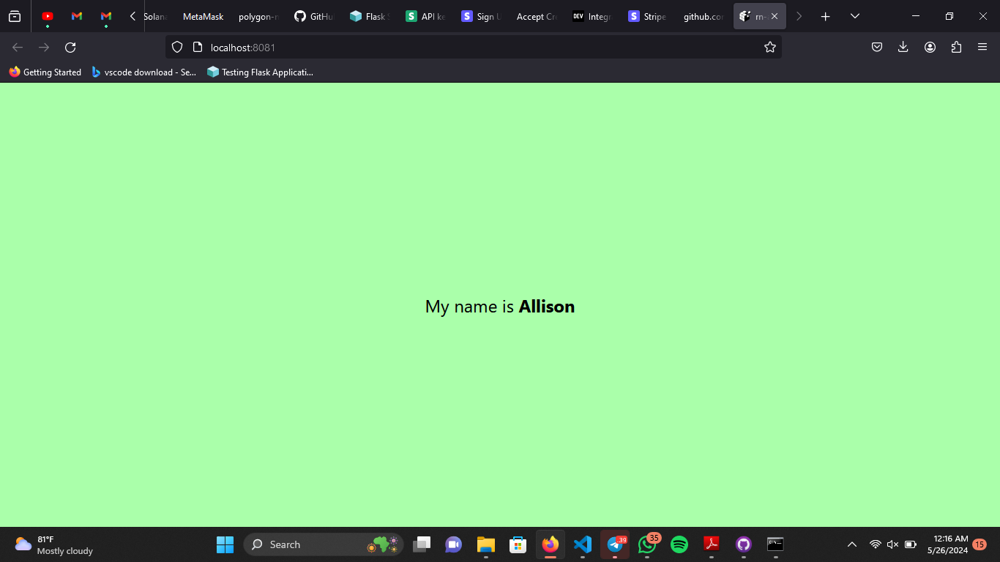
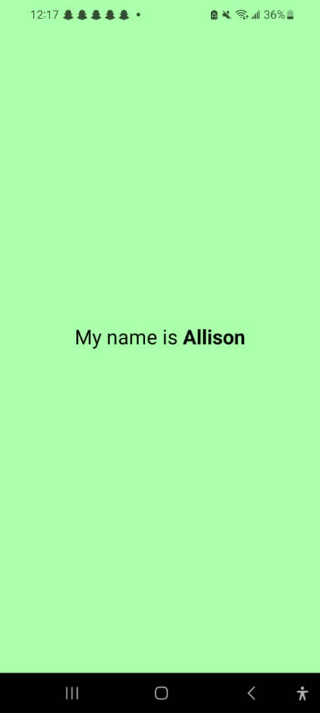

#React Native Assignment 2

## Creating an Expo App

This app was created with `npx create-expo-app appName --template blank`

## Task Description

We were asked to create an expo app and change the background to a colour of our choice,
then we were to change the text to say "My name is myName" with the myName as bold to make it look like "My name is *myName*" and make the font size 24

## Images of the App

### On the Web browser of the Computer

### On an Android Device

